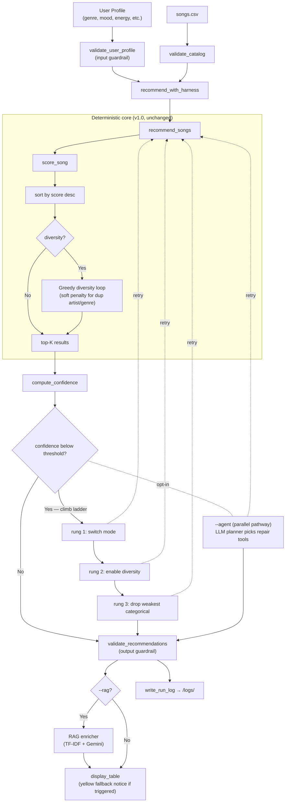
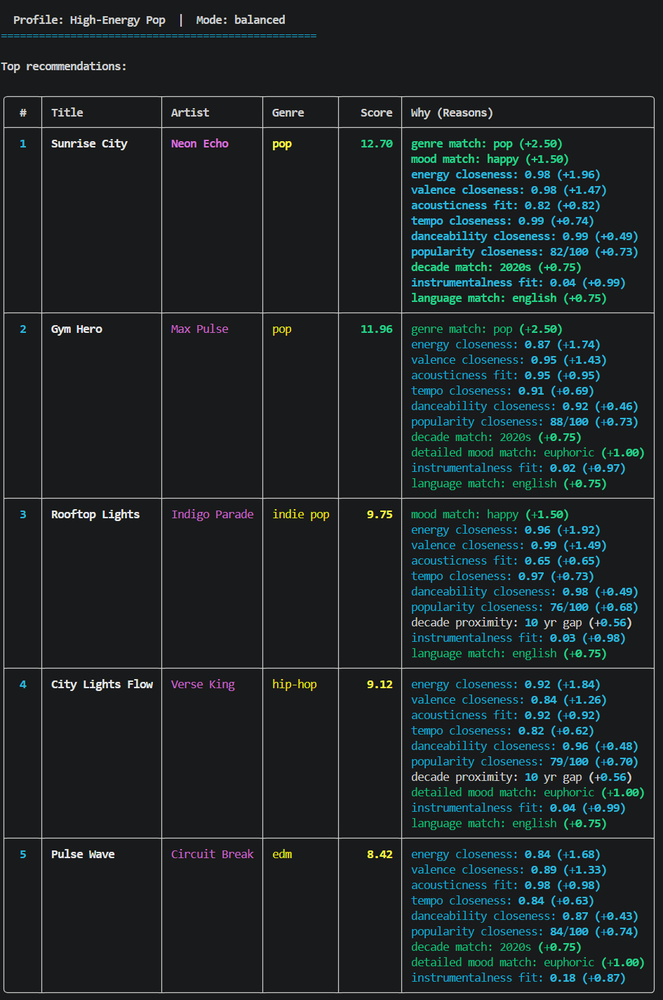
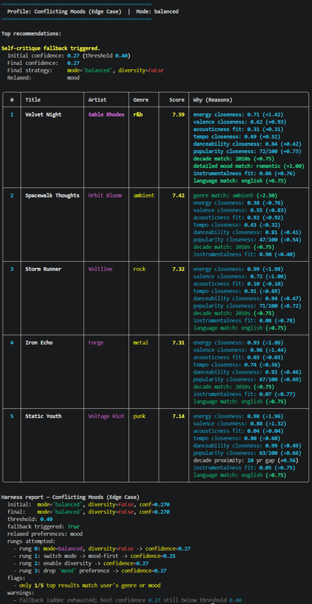
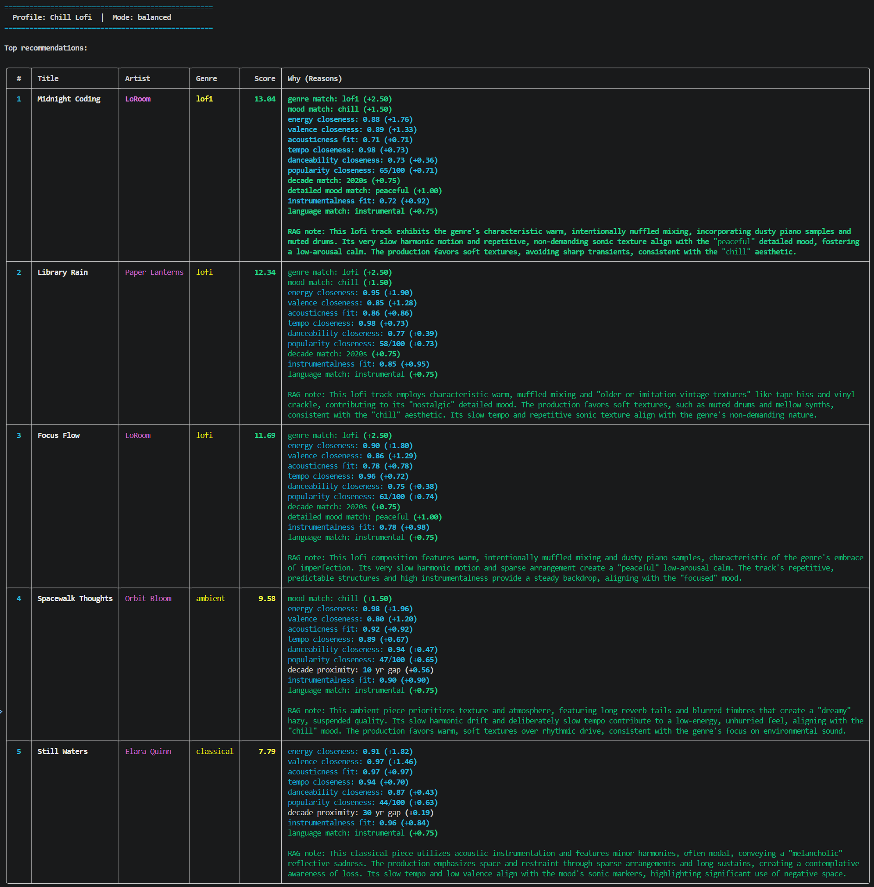

# Resonance Selector 2.0

A content-based music recommender wrapped in a self-critique reliability layer, with optional retrieval-augmented explanations and an LLM planning agent. Built on the Module 3 *Music Recommender Simulation* base project (Resonance Selector 1.0) and extended into a complete applied-AI system for AI110, Module 4.

## Project Summary

You give the system a taste profile — a preferred genre, mood, energy level, and a handful of other preferences — and it scores every song in the catalog using a weighted closeness model, then returns the top five matches with a plain-language explanation of why each track was chosen. Version 2.0 adds a *reliability harness* that validates inputs, scores how confident the recommendation is, and — when confidence is low — automatically tries a sequence of repair strategies until a better result is found or the strategies are exhausted. Optional flags add retrieval-grounded natural-language commentary (`--rag`), persona styling for that commentary (`--persona`), and an LLM planning agent (`--agent`) that picks repair tools one step at a time instead of following the hardcoded fallback ladder.

## Original Project

The base project for this build is **Module 3's Music Recommender Simulation**, which I named **Resonance Selector 1.0**. That version was a deterministic content-based recommender: it scored 20 songs across 15 attributes using a weighted closeness model, supported 5 user profiles, 4 scoring modes (`balanced`, `genre-first`, `mood-first`, `energy-focused`), and an optional diversity penalty to reduce artist/genre repetition in the top results. Resonance Selector 2.0 keeps that scoring core unchanged and wraps it with the AI features described below.

## What's New in 2.0

- **Self-critique fallback ladder** — when initial confidence falls below threshold, the system automatically tries: switch scoring mode → enable diversity penalty → drop the weakest categorical preference. The user sees a yellow notice above the table whenever a fallback fires.
- **Input + output guardrails** — clamps out-of-range numerics, drops malformed catalog rows, deduplicates results, and enforces deterministic tiebreaks.
- **Confidence scoring** — combines the score gap between the top result and the rest, categorical-match coverage, and diversity into a single [0, 1] reliability number.
- **Run logging** — every harness call writes a JSON log to `/logs/` with the full repair trace, warnings, and final result.
- **Evaluation harness** — `scripts/evaluate.py` runs 40 matrix configurations (5 profiles × 4 modes × 2 diversity settings) plus 12 edge cases against a frozen golden baseline.
- **RAG-enriched explanations** (`--rag`) — TF-IDF retrieval over `/docs/` knowledge base, then a Google Gemini API call generates grounded commentary.
- **Persona specialization** (`--persona`) — four persona presets constrain the RAG voice via system prompt + few-shot examples, producing measurably different output styles for the same recommendations.
- **LLM planning agent** (`--agent`) — opt-in alternative to the deterministic ladder. The agent picks repair tools one step at a time and prints its reasoning chain.

## Architecture Overview

The system is organized as a deterministic core (unchanged from v1.0) wrapped in a reliability layer. A request flows through these stages: **profile in → input validation → core scoring (with optional diversity penalty) → confidence check → optional fallback ladder OR LLM agent → optional RAG enrichment → table output + run log**. Logging, validation, and the confidence gate are the parts that make the system safer to ship; the LLM features (RAG, agent) are gated behind opt-in flags so the deterministic path stays reproducible.



The **evaluation flow** is a separate offline script (`scripts/evaluate.py`) that runs the same harness across the full profile × mode × diversity matrix plus 12 edge cases, then compares every result to a frozen golden baseline and fails on any unintended ranking change.

## Setup Instructions

1. **Create a virtual environment** (optional but recommended):

   ```bash
   python -m venv .venv
   source .venv/bin/activate      # Mac or Linux
   .venv\Scripts\activate         # Windows
   ```

2. **Install dependencies:**

   ```bash
   pip install -r requirements.txt
   ```

3. **(Optional, only for `--rag` and `--agent`)** Add a free Google Gemini API key:

   ```bash
   cp .env.example .env
   # then open .env and paste your key from https://aistudio.google.com/app/apikey
   ```

   Without the key, `--rag` falls back to deterministic explanations with a printed warning, and `--agent` will refuse to start. The rest of the system works without it.

4. **Run the app** (default profile is High-Energy Pop in balanced mode):

   ```bash
   python -m src.main
   ```

5. **Run the test suite:**

   ```bash
   pytest
   ```

6. **Run the evaluation harness:**

   ```bash
   python -m scripts.evaluate
   ```

## Sample Interactions

**1. Happy path — high confidence, no fallback fires.**

```bash
python -m src.main --profile high_energy_pop
```

Initial confidence ≈ 0.46 (above the 0.40 threshold). The harness validates the input, runs the core scorer, scores confidence, and returns the top-5 directly. Top result: *Sunrise City* (12.70 pts, perfect pop + happy genre/mood match).



**2. Adversarial path — fallback ladder fires.**

```bash
python -m src.main --profile conflicting_moods --explain-harness
```

The profile asks for ambient + sad + high energy — internally contradictory. Initial confidence: 0.27. The harness climbs the ladder: rung 1 (switch to mood-first), rung 2 (enable diversity), rung 3 (drop the `mood` preference, since "sad" matches no song in the catalog). The user sees a yellow notice above the table explaining the adjustment, and `--explain-harness` prints the full rung trace underneath.



**3. RAG-enriched recommendation.**

```bash
python -m src.main --profile chill_lofi --rag --persona analytical
```

Each top-5 song's explanation is augmented with a grounded natural-language paragraph generated by Gemini. The model is given retrieved snippets from `docs/genres/lofi.md`, `docs/moods/chill.md`, and `docs/detailed_moods/peaceful.md` so the prose stays anchored in the curated knowledge base rather than hallucinated. The deterministic scoring reasons remain visible above the RAG note so the user always sees both the math and the prose. Also engages the "analytical" persona mode that measurably impacts the tone of the RAG response.



## CLI Flags

| Command | What it does |
|---|---|
| `python -m src.main` | Runs the default High-Energy Pop profile in balanced mode |
| `--profile <name>` | Run a single named profile |
| `--all` | Run all five profiles in sequence |
| `--mode <mode>` | Apply a scoring mode: `balanced`, `genre-first`, `mood-first`, `energy-focused` |
| `--diversity` | Enable the diversity penalty to reduce artist/genre repetition |
| `--explain-harness` | Print the full self-critique report (rung trace, flags, warnings) |
| `--no-harness` | Bypass the reliability harness — useful for A/B comparison |
| `--rag` | Enrich explanations via Gemini API (requires `GEMINI_API_KEY`) |
| `--persona <name>` | RAG voice: `default`, `analytical`, `enthusiast`, `historian` |
| `--agent` | Use the LLM planning agent instead of the deterministic ladder (requires `GEMINI_API_KEY`; mutually exclusive with `--no-harness`) |
| `--help` | Print usage and list available profiles and modes |
| `python -m scripts.evaluate` | Run the full 40-config + 12-edge-case matrix against the golden baseline |
| `python -m scripts.evaluate --update-golden` | Regenerate the golden baseline (after intentional weight or catalog changes) |
| `python -m scripts.evaluate --verbose` | Show per-row detail for every matrix run |

All flags are independent and combinable except for the `--agent` / `--no-harness` exclusion.

## Design Decisions and Trade-offs

- **Deterministic core wrapped in an LLM layer.** The v1.0 scoring functions are byte-for-byte unchanged so the 40-run regression matrix stays reproducible. All non-determinism (RAG, agent) is opt-in and runs *after* the core decides what to recommend.
- **Weighted closeness over flat match/no-match.** A flat "+2 if same genre" recipe treats every song with the same label as equally good. The closeness model penalizes drift on energy and valence even within a matching genre, which produces noticeably better results when the user wants a specific *feel* and not just a label. The cost: more weights to tune, and the scoring math is harder to explain in one sentence.
- **Soft diversity penalty over hard exclusion.** Duplicate artist/genre is *discounted* (−2.0 / −1.5 pts), not banned. A strong duplicate can still appear if it outscores rivals after the deduction. This preserves the right answer when the catalog is genuinely thin in a category.
- **Confidence-gated fallback rather than always-rerank.** Rerunning the recommender under multiple modes for every request would mask genuine high-confidence answers and burn compute. The harness only climbs the ladder when initial confidence is below threshold, and stops the moment confidence improves enough.
- **LLM agent as a parallel pathway, not a replacement for the ladder.** Swapping the deterministic ladder for a stochastic LLM call would couple the regression matrix to API availability and break reproducibility. `--agent` is therefore a parallel route activated only on demand; the deterministic ladder remains the default and is what the test harness exercises.

## Testing Summary

The pytest suite in `tests/` covers the deterministic recommender, input/output validators, confidence scoring, the self-critique loop, the RAG retriever and enricher (with API calls mocked), and the LLM planning agent (with a scripted decider so no real Gemini calls are made). The evaluation harness (`python -m scripts.evaluate`) is the integration-level reliability check: it runs the full profile × mode × diversity matrix plus 12 edge cases against a frozen golden baseline.

Latest evaluation run (recorded at v2.0 release; reproducible from the committed catalog and weights):

```
Resonance Selector 2.0 -- Evaluation Harness
============================================
Catalog: data/songs.csv (20 songs, hash d05dd3e4f0e21a17)
Weights: hash d308232a0ea82c32
Golden:  tests/golden/expected_outputs.json (matches: YES)

Matrix runs:        40/40 passed
Edge cases:         12/12 passed
Confidence avg:     0.44
Fallback triggers:  12/40 runs (30%)

PASS
```

The 12 edge cases include `empty_catalog`, `unknown_genre`, `out_of_range_energy`, `missing_required_field`, `wrong_type_field`, `duplicate_in_catalog`, `nan_score_filtered`, `single_song_genre_jazz`, `tie_at_boundary`, `homogeneous_top5`, `relax_after_double_mismatch`, and `diversity_breaks_clusters`. Each one asserts a specific guardrail behavior — e.g., the harness must raise on a duplicate catalog id, must clamp out-of-range energy with a warning, and must drop NaN-score rows while still producing a 5-result list. The 30% fallback rate reflects the adversarial `conflicting_moods` profile (which fires on every mode) and the `focused_jazz` profile under modes that under-weight the genre bonus, since jazz has only one song in the catalog.

## Limitations

- **Genre dominance.** The +2.5 genre bonus often beats an excellent cross-genre fit. `--mode energy-focused` or `--mode mood-first` reduces this.
- **Small-catalog blind spots.** Some genres have only one song. Beyond that single match, the system falls back to "nearest energy" approximations from other genres.
- **No learning loop.** Profiles are static. There is no "skip this artist" or "more like this" feedback path.
- **Numeric input friction.** Real listeners describe taste in words ("workout music"), not floats (`energy: 0.80`). The translation step introduces error before any recommendation is made.

For a deeper analysis of biases, intended use, and known failure modes, see [model_card.md](model_card.md).

## Reflection

**What this project taught me about AI and problem-solving.**

AI has gotten extremely proficient at creating moderately complex projects such as this one. However, it's important to give it instructions that are clearly defined and not too large in scope. Context windows matter immensely, and the practice of starting new chats to implement new features is rather important. Also, in the process of doing this, creating and updating the instructions so that the AI knows it has a new starting point is important to not waste context. Clearly, the stakes for this project are rather low, if the system fails, it's only a toy demo. One could imagine the extra level of engineering that would be involved for a system where security or extreme efficiency is paramount, and you would definitely need a human (or a team) in the loop to ensure proper execution. There's a sense where a tool is only as useful as the tool-user. The more you know about code, system architecture, and LLMs in general, the more that you can leverage the tool that is AI. The issue of hallucination was unnoticeable or non-existent throughout this project, but that's not to say it's not a concern. Reviewing the changes each step of the way, testing, and maintaining version control allowed for a smooth development process.

**What this project says about me as an AI engineer.**

Building this taught me to value the engineering around the AI as much as the AI itself. The deterministic core, the confidence-gated fallback ladder, the golden-baseline tests, and the visible JSON logs are what make the LLM features (RAG, agent, persona) safe to layer on top. The LLM features are additions on top of a system that already works deterministically. They extend it instead of replacing it. I also leaned on multiple models against each other: Claude for code generation, Gemini Pro as a code reviewer, and my own judgment as the tiebreaker when they disagreed. What I want to ship is systems that are honest about their limits, not ones that hide them behind confident-sounding output.

## Loom Walkthrough

Project Video Walkthrough: https://vimeo.com/1186813757

## Further Reading

- [model_card.md](model_card.md) — intended use, data, strengths, limitations and bias, evaluation, future work.
- [reflection.md](reflection.md) — longer-form reflection on the build process and AI collaboration.
