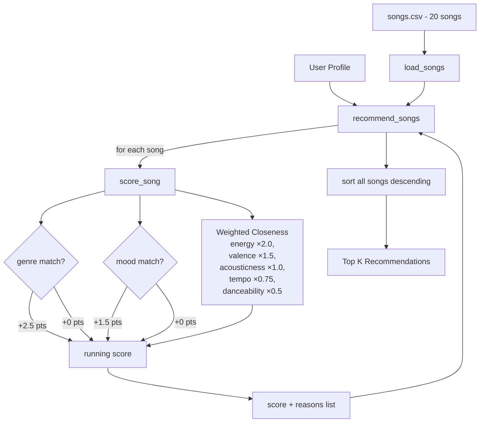

# 🎵 Resonance Selector 1.0

## Project Summary

This simulation implements a **content-based music recommender** called Resonance Selector 1.0. You give it a taste profile — a preferred genre, mood, energy level, and a handful of other preferences — and it scores every song in the catalog using a weighted closeness model, then returns the top five matches with a plain-language explanation of why each track was chosen. The system now supports 15 song attributes including advanced features like popularity, release decade, detailed mood tags, instrumentalness, and language style.

---

## How The System Works

Real-world music recommenders like Spotify and TikTok build a mathematical fingerprint for each song using measurable audio features — things like energy, tempo, and emotional positivity (valence) — and then find songs whose fingerprints are close to what a user has previously enjoyed. They combine two main strategies: **content-based filtering** (matching song audio profiles to a user's stated or inferred taste) and **collaborative filtering** (finding users with similar listening histories and surfacing what they enjoyed). This simulation focuses on **content-based filtering**, using the emotional and kinetic feel of each song — primarily the valence-energy "vibe matrix" — as its scoring foundation, with genre and mood acting as guardrails to keep recommendations coherent.

### `Song` Features

| Feature | Type | Role |
|---|---|---|
| `genre` | categorical | Match/no-match guardrail |
| `mood` | categorical | Match/no-match guardrail |
| `energy` | float (0–1) | Core "vibe" axis — intensity and activity |
| `valence` | float (0–1) | Core "vibe" axis — musical positivity/happiness |
| `acousticness` | float (0–1) | Texture: acoustic instruments vs. electronic |
| `tempo_bpm` | float | Structural pacing — BPM |
| `danceability` | float (0–1) | Rhythmic suitability for dancing |
| `popularity` | int (0–100) | Track popularity score |
| `release_decade` | int | Decade of release (e.g. 1990, 2010, 2020) |
| `detailed_mood_tag` | categorical | Fine-grained emotional label (e.g. `"euphoric"`, `"nostalgic"`, `"aggressive"`) |
| `instrumentalness` | float (0–1) | Degree to which the track is vocal-free |
| `language` | categorical | Lyrics style: `"english"`, `"instrumental"`, `"multilingual"` |

### `UserProfile` Fields

| Field | Type | Purpose |
|---|---|---|
| `favorite_genre` | str | Preferred genre (e.g. `"pop"`, `"lofi"`) |
| `favorite_mood` | str | Preferred mood tag (e.g. `"chill"`, `"happy"`) |
| `target_energy` | float | Desired energy level (0.0–1.0) |
| `likes_acoustic` | bool | Whether user prefers acoustic over electronic texture |
| `target_popularity` | int | Desired popularity level (0–100) |
| `preferred_decade` | int | Preferred release era (e.g. `2000`, `2010`, `2020`) |
| `favorite_detailed_mood` | str | Fine-grained mood preference (e.g. `"euphoric"`, `"peaceful"`) |
| `target_instrumentalness` | float | Preferred vocal-to-instrumental ratio (0.0–1.0) |
| `preferred_language` | str | Preferred lyrics language style (`"english"`, `"instrumental"`, `"multilingual"`) |

### Scoring Algorithm

Rather than a flat points-for-category-match system, this simulation uses a **weighted closeness model**. Every feature contributes a score proportional to how similar the song is to the user's preferences, so distance matters — not just match/no-match.

**Categorical (binary):**
- Genre match: **+2.5 pts**
- Mood match: **+1.5 pts**
- Detailed mood tag match: **+1.0 pts**
- Language match: **+0.75 pts**

**Continuous feature closeness** — each feature earns `(1 − |song_value − user_value|) × weight`:

| Feature | Weight | Rationale |
|---|---|---|
| `energy` | ×2.0 | Strongest predictor of perceived vibe |
| `valence` | ×1.5 | Emotional positivity — the core "feel" of a song |
| `acousticness` | ×1.0 / ×0.75 | Full weight if `likes_acoustic=True`, reduced otherwise |
| `tempo_bpm` | ×0.75 | BPM normalized to 0–1 scale (60–200 BPM range) before scoring |
| `danceability` | ×0.5 | Secondary preference signal |
| `popularity` | ×0.75 | Proximity to desired fame level; gap normalized over 0–100 |
| `release_decade` | ×0.75 | Era alignment; decade gap normalized over 40-year span |
| `instrumentalness` | ×1.0 | Vocal-to-instrumental ratio proximity |

**Maximum possible score: ~14.0 pts**

**Why this outperforms a flat recipe:** A flat +2.0 genre / +1.0 mood system treats all songs in the same genre as equally good. The closeness model penalizes songs that drift far on energy or valence even within the same genre — so an intense lofi track won't score the same as a calm focused lofi track when the user wants something quiet.

### Data Flow



### Starter User Profile

The default profile for initial testing:

```python
user_prefs = {
    "genre": "lofi",
    "mood": "focused",
    "energy": 0.45,
    "likes_acoustic": True
}
```

Represents a user who prefers calm, acoustic-leaning background music for focused work. Expected top results: *Focus Flow*, *Midnight Coding*, *Library Rain*.

### Potential Biases

- **Genre dominance:** The +2.5 genre bonus means even a mediocre genre match will often beat an excellent cross-genre fit. A perfect energy/valence/mood alignment in the wrong genre will almost always lose.
- **Small catalog effect:** With 20 songs, rare moods like `euphoric` or `aggressive` have only one representative track each. A mood match there wins by default rather than by merit.
- **Acoustic binary:** `likes_acoustic` is a single boolean — it can't capture context-specific preferences (e.g., "acoustic folk yes, acoustic slow ballads no"), which may over- or under-penalize songs depending on the profile.

---

## Getting Started

### Setup

1. Create a virtual environment (optional but recommended):

   ```bash
   python -m venv .venv
   source .venv/bin/activate      # Mac or Linux
   .venv\Scripts\activate         # Windows

2. Install dependencies

```bash
pip install -r requirements.txt
```

3. Run the app:

```bash
python -m src.main
```

### CLI Flags

The recommender is controlled entirely from the command line. All commands are run from the project root.

| Command | What it does |
|---|---|
| `python -m src.main` | Runs the default **High-Energy Pop** profile |
| `python -m src.main --profile <name>` | Runs a single named profile |
| `python -m src.main --all` | Runs all five profiles in sequence |
| `python -m src.main --help` | Prints usage info and lists available profile names |

**Available profiles:**

| Profile name | Description |
|---|---|
| `high_energy_pop` | Upbeat, danceable pop music — the default |
| `chill_lofi` | Quiet, acoustic-leaning lofi for studying or relaxing |
| `deep_intense_rock` | Loud, fast, aggressive rock |
| `conflicting_moods` | Adversarial edge case: high energy + sad mood + ambient genre |
| `focused_jazz` | Calm, mid-energy jazz for concentration |

**Examples:**

```bash
# Run the chill lofi profile
python -m src.main --profile chill_lofi

# Run every profile and compare results
python -m src.main --all

# See all available options
python -m src.main --help
```

### Example of Results from Initial Terminal
Demo output for a "pop/happy" profile.


### Running Tests

Run the starter tests with:

```bash
pytest
```

You can add more tests in `tests/test_recommender.py`.

---
## Output for various different user profiles:

High-Energy Pop


Chill Lofi


Deep Intense Rock


Conflicting Moods (Edge Case)


Focused Jazz


## Experiments You Tried

**Weight shift: doubling energy, halving genre.**

One experiment changed the energy weight from ×2.0 to ×4.0 and cut the genre bonus from 2.5 to 1.25 points. The goal was to test whether making the system more sensitive to how a song *feels* rather than what *label* it carries would improve results.

For the Conflicting Moods profile (high energy + sad + ambient), the shift was clearly an improvement. The ambient song Spacewalk Thoughts — which had been winning on genre label alone despite a massive energy mismatch — fell out of the top 5, and high-energy tracks correctly took its place.

For the Focused Jazz profile, the shift backfired. The only actual jazz track dropped to rank 2, replaced by a lofi song that simply happened to share a closer energy value. Without the genre bonus anchoring the result, the label stopped mattering.

The takeaway: the right balance between genre and energy depends on the listener. Genre labels matter more when users strongly identify with a genre. Energy matters more when users care about vibe over category. A fixed weight for all profiles is a compromise that serves no one perfectly.

**Five profiles, five different behaviors.**

Running all profiles back-to-back (via `--all`) revealed that the system's reliability is tightly tied to catalog coverage. The Chill Lofi and Deep Intense Rock profiles worked best — both genres have multiple songs in the dataset, and the energy spread within those groups is distinct enough for the closeness scoring to do real work. The Focused Jazz profile exposed the limit: one jazz song means the second result is always a guess. The Conflicting Moods profile showed the genre-bonus problem most starkly — an ambient track topped the chart for a user asking for high energy.

---

## Limitations and Risks

**Genre label acts like a VIP pass.** A genre match awards 2.5 points upfront — more than the maximum energy score a song can earn. This means a song can rank highly simply because it shares a label with your preferred genre, even if everything else about it feels wrong. In testing, Gym Hero kept appearing in top results for users who wanted happy, upbeat pop — because it's tagged pop. Its actual mood is "intense," not "happy." The system doesn't know the difference.

**Small catalog, big blind spots.** With 20 songs, some genres appear just once. If you prefer jazz there is literally one jazz song in the catalog. After that, the system defaults to lofi and ambient tracks that happen to have similar energy levels — which is not jazz, just a nearby approximation. This creates a quiet filter bubble for anyone whose taste falls outside the three or four most represented genres.

**The system cannot learn or adapt.** Every recommendation is made from a frozen profile. There is no way to say "skip this artist" or "I liked that one." In Spotify or TikTok, every play and skip updates the model. Here the profile stays static — so if the first results miss the mark, the system has no way to correct itself.

**Preferences must be expressed as numbers.** To get accurate results, you supply values like `energy: 0.80` or `target_tempo: 120`. Real listeners don't think in fractions. Most people describe their taste in words — "something to work out to" or "chill background music." That translation step introduces error before any recommendation is made.

See [model_card.md](model_card.md) for a deeper analysis.

---

## Reflection

The biggest learning from this project was how much a small dataset limits what a recommender can actually do. The Focused Jazz profile made that concrete: after the one jazz song in the catalog, the system had nothing to work with and started returning lofi tracks that happened to share a similar energy level. That gap between "no match found" and "wrong match returned with confidence" is invisible unless you test it — and it's exactly the kind of silent failure that would erode trust in a real product.

AI tools were genuinely useful during the build, but in a specific way: they handled repetitive structural work — CSV loading, function scaffolding, output formatting — which freed up attention for the parts that actually mattered, like verifying that the scoring math produced sensible results. Every generated scoring rule still had to be checked against the underlying logic. That verification step is where most of the real learning happened, and it's a good reminder that AI-assisted code needs the same scrutiny as hand-written code.

What was most surprising was how much a few weighted subtractions can *feel* like a real recommendation. When the system returned Library Rain and Midnight Coding for the Chill Lofi profile, the results felt right — not because anything intelligent was happening, but because the math captured the same intuition a person would use. There is no machine learning, no training data, no neural network. Just subtraction and multiplication. And yet the output feels personal. That's both impressive and slightly unsettling, because the same mechanism also produces confidently wrong results — like recommending Gym Hero when you asked for something happy.

[**Full Model Card →**](model_card.md)


---
<!--
## 7. `model_card_template.md`

Combines reflection and model card framing from the Module 3 guidance. :contentReference[oaicite:2]{index=2}  

```markdown
# 🎧 Model Card - Music Recommender Simulation

## 1. Model Name

Give your recommender a name, for example:

> VibeFinder 1.0

---

## 2. Intended Use

- What is this system trying to do
- Who is it for

Example:

> This model suggests 3 to 5 songs from a small catalog based on a user's preferred genre, mood, and energy level. It is for classroom exploration only, not for real users.

---

## 3. How It Works (Short Explanation)

Describe your scoring logic in plain language.

- What features of each song does it consider
- What information about the user does it use
- How does it turn those into a number

Try to avoid code in this section, treat it like an explanation to a non programmer.

---

## 4. Data

Describe your dataset.

- How many songs are in `data/songs.csv`
- Did you add or remove any songs
- What kinds of genres or moods are represented
- Whose taste does this data mostly reflect

---

## 5. Strengths

Where does your recommender work well

You can think about:
- Situations where the top results "felt right"
- Particular user profiles it served well
- Simplicity or transparency benefits

---

## 6. Limitations and Bias

Where does your recommender struggle

Some prompts:
- Does it ignore some genres or moods
- Does it treat all users as if they have the same taste shape
- Is it biased toward high energy or one genre by default
- How could this be unfair if used in a real product

---

## 7. Evaluation

How did you check your system

Examples:
- You tried multiple user profiles and wrote down whether the results matched your expectations
- You compared your simulation to what a real app like Spotify or YouTube tends to recommend
- You wrote tests for your scoring logic

You do not need a numeric metric, but if you used one, explain what it measures.

---

## 8. Future Work

If you had more time, how would you improve this recommender

Examples:

- Add support for multiple users and "group vibe" recommendations
- Balance diversity of songs instead of always picking the closest match
- Use more features, like tempo ranges or lyric themes

---

## 9. Personal Reflection

A few sentences about what you learned:

- What surprised you about how your system behaved
- How did building this change how you think about real music recommenders
- Where do you think human judgment still matters, even if the model seems "smart"
-->
