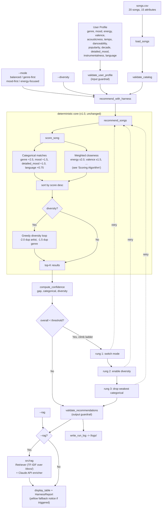
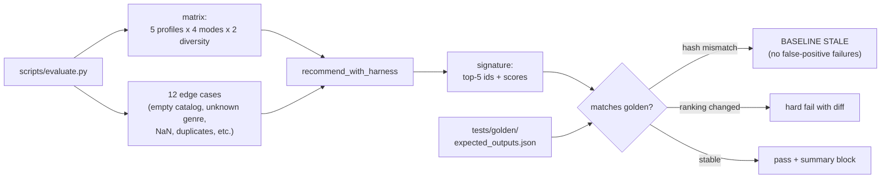
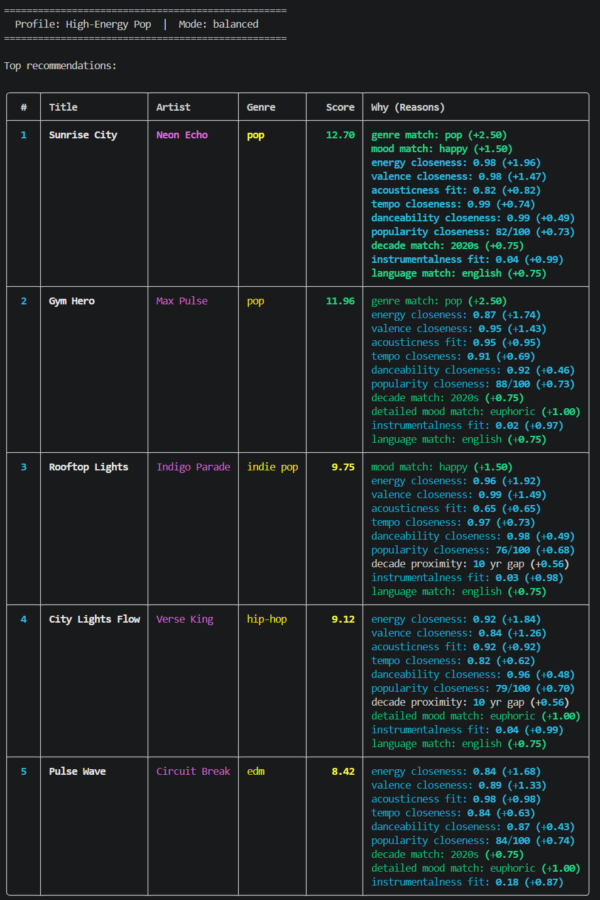

# 🎵 Resonance Selector 2.0

> Resonance Selector 1.0 was a deterministic content-based music recommender (15-attribute weighted closeness scoring, 5 user profiles, 4 scoring modes, optional diversity penalty). Version 2.0 wraps that core in a **self-critique reliability harness** with input/output guardrails, confidence scoring, and an automatic fallback ladder, plus an optional **RAG-enriched explanation layer** that grounds natural-language commentary in a curated `/docs/` knowledge base via the Anthropic Claude API.

## Project Summary

This project implements a **content-based music recommender** called Resonance Selector 2.0. You give it a taste profile — a preferred genre, mood, energy level, and a handful of other preferences — and it scores every song in the catalog using a weighted closeness model, then returns the top five matches with a plain-language explanation of why each track was chosen. The system supports 15 song attributes including advanced features like popularity, release decade, detailed mood tags, instrumentalness, and language style. An optional **diversity penalty** (`--diversity`) prevents the same artist or genre from monopolising the top results.

In version 2.0, every recommendation now goes through a **reliability harness** that validates the user profile, scores the result's confidence, and — when confidence falls below threshold — automatically tries a sequence of fallback strategies (switching scoring mode, enabling diversity, relaxing the weakest categorical preference) until either a better result is found or the strategies are exhausted. A standalone evaluation script (`scripts/evaluate.py`) runs the full profile × mode × diversity matrix plus a battery of edge cases and compares against a frozen golden baseline.

### What's new in 2.0

- **Self-critique fallback ladder** — `recommend_with_harness()` wraps `recommend_songs()` and triggers automatic strategy retries on low-confidence results. Visible to the user as a yellow notice above the table whenever a fallback fires.
- **Input + output guardrails** — `src/harness/validators.py` clamps out-of-range numerics, drops malformed catalog rows, dedupes results, and enforces deterministic tiebreaks.
- **Confidence scoring** — combines a top-vs-rest score gap, categorical-match coverage, and diversity into one [0, 1] reliability number.
- **Run logging** — every harness call writes a JSON log to `/logs/` with the rung trace, warnings, and final result.
- **Evaluation script** — `python -m scripts.evaluate` runs 40 matrix configurations + 12 edge cases against a golden baseline and prints a pass/fail summary.
- **RAG-enriched explanations** (`--rag`) — TF-IDF retrieval over `/docs/genres/`, `/docs/moods/`, and `/docs/detailed_moods/`, then a single Google Gemini API call to generate grounded natural-language commentary.
- **Persona specialization** (`--persona`) — four persona presets (`default`, `analytical`, `enthusiast`, `historian`) constrain the RAG voice via system prompt + few-shot examples, producing measurably different output styles for the same recommendation set.
- **CLI additions** — `--explain-harness`, `--no-harness`, `--rag`, `--persona` for demo and A/B comparison.

---

## How The System Works

Real-world music recommenders like Spotify and TikTok build a mathematical fingerprint for each song using measurable audio features — things like energy, tempo, and emotional positivity (valence) — and then find songs whose fingerprints are close to what a user has previously enjoyed. They combine two main strategies: **content-based filtering** (matching song audio profiles to a user's stated or inferred taste) and **collaborative filtering** (finding users with similar listening histories and surfacing what they enjoyed). This simulation focuses on **content-based filtering**, using the emotional and kinetic feel of each song — primarily the valence-energy "vibe matrix" — as its scoring foundation, with genre and mood acting as guardrails to keep recommendations coherent.

### `Song` Features

| Feature | Type | Role |
|---|---|---|
| `genre` | categorical | Match/no-match guardrail |
| `mood` | categorical | Match/no-match guardrail |
| `energy` | float (0–1) | Core "vibe" axis — intensity and activity |
| `valence` | float (0–1) | Core "vibe" axis — musical positivity/happiness |
| `acousticness` | float (0–1) | Texture: acoustic instruments vs. electronic |
| `tempo_bpm` | float | Structural pacing — BPM |
| `danceability` | float (0–1) | Rhythmic suitability for dancing |
| `popularity` | int (0–100) | Track popularity score |
| `release_decade` | int | Decade of release (e.g. 1990, 2010, 2020) |
| `detailed_mood_tag` | categorical | Fine-grained emotional label (e.g. `"euphoric"`, `"nostalgic"`, `"aggressive"`) |
| `instrumentalness` | float (0–1) | Degree to which the track is vocal-free |
| `language` | categorical | Lyrics style: `"english"`, `"instrumental"`, `"multilingual"` |

### `UserProfile` Fields

| Field | Type | Purpose |
|---|---|---|
| `favorite_genre` | str | Preferred genre (e.g. `"pop"`, `"lofi"`) |
| `favorite_mood` | str | Preferred mood tag (e.g. `"chill"`, `"happy"`) |
| `target_energy` | float | Desired energy level (0.0–1.0) |
| `likes_acoustic` | bool | Whether user prefers acoustic over electronic texture |
| `target_popularity` | int | Desired popularity level (0–100) |
| `preferred_decade` | int | Preferred release era (e.g. `2000`, `2010`, `2020`) |
| `favorite_detailed_mood` | str | Fine-grained mood preference (e.g. `"euphoric"`, `"peaceful"`) |
| `target_instrumentalness` | float | Preferred vocal-to-instrumental ratio (0.0–1.0) |
| `preferred_language` | str | Preferred lyrics language style (`"english"`, `"instrumental"`, `"multilingual"`) |

### Scoring Algorithm

Rather than a flat points-for-category-match system, this simulation uses a **weighted closeness model**. Every feature contributes a score proportional to how similar the song is to the user's preferences, so distance matters — not just match/no-match.

The weights below are the **`balanced` defaults**. The `--mode` flag (see CLI Flags) lets you shift priorities at runtime — boosting one dimension while suppressing the others.

**Categorical (binary):**
- Genre match: **+2.5 pts**
- Mood match: **+1.5 pts**
- Detailed mood tag match: **+1.0 pts**
- Language match: **+0.75 pts**

**Continuous feature closeness** — each feature earns `(1 − |song_value − user_value|) × weight`:

| Feature | Weight | Rationale |
|---|---|---|
| `energy` | ×2.0 | Strongest predictor of perceived vibe |
| `valence` | ×1.5 | Emotional positivity — the core "feel" of a song |
| `acousticness` | ×1.0 | Acoustic vs. electronic texture preference |
| `tempo_bpm` | ×0.75 | BPM normalized to 0–1 scale (60–200 BPM range) before scoring |
| `danceability` | ×0.5 | Secondary preference signal |
| `popularity` | ×0.75 | Proximity to desired fame level; gap normalized over 0–100 |
| `release_decade` | ×0.75 | Era alignment; decade gap normalized over 40-year span |
| `instrumentalness` | ×1.0 | Vocal-to-instrumental ratio proximity |

**Maximum possible score: ~14.0 pts** (balanced mode)

### Diversity Penalty (optional)

By default the system picks the top-K songs by raw score, which can produce a list dominated by one genre or one artist. Passing `--diversity` activates a **greedy selection loop** that adjusts for this:

1. Score every song as normal and sort descending.
2. Build the top-5 list one slot at a time. After each pick, track which artists and genres have already been selected.
3. For every remaining candidate, subtract a penalty if its artist or genre is already represented:
   - **−2.0 pts** for a duplicate artist
   - **−1.5 pts** for a duplicate genre
4. Pick the candidate with the best adjusted score, add it to the list, update the seen sets, repeat.

The penalty is **soft** — a strong song from a repeated genre can still appear if it outscores its rivals even after the deduction. The penalty amount and the reason it fired (`diversity penalty: duplicate genre (pop) -1.5`) are always shown in the "Because:" line so the trade-off is visible.

Penalty values were chosen to mirror the corresponding match bonuses in balanced mode (genre match = +2.5, mood match = +1.5), so a duplicate costs roughly as much as one matching label is worth.

**Why this outperforms a flat recipe:** A flat +2.0 genre / +1.0 mood system treats all songs in the same genre as equally good. The closeness model penalizes songs that drift far on energy or valence even within the same genre — so an intense lofi track won't score the same as a calm focused lofi track when the user wants something quiet.

### Data Flow (v2.0)

The deterministic core (`load_songs`, `score_song`, `recommend_songs`, optional `--diversity` greedy loop) is unchanged from v1.0. Version 2.0 wraps it with input validation, confidence scoring, a fallback ladder, output validation, and optional RAG enrichment.



**Evaluation flow** (separate; runs offline against the same harness):



### Starter User Profile

The default profile for initial testing:

```python
user_prefs = {
    "genre": "lofi",
    "mood": "focused",
    "energy": 0.45,
    "likes_acoustic": True
}
```

Represents a user who prefers calm, acoustic-leaning background music for focused work. Expected top results: *Focus Flow*, *Midnight Coding*, *Library Rain*.

### Potential Biases

- **Genre dominance:** The +2.5 genre bonus means even a mediocre genre match will often beat an excellent cross-genre fit. A perfect energy/valence/mood alignment in the wrong genre will almost always lose. Use `--mode energy-focused` or `--mode mood-first` to reduce genre's influence.
- **Artist/genre repetition:** Without `--diversity`, the same artist or genre can fill most of the top-5 slots. `--diversity` applies a soft penalty (−2.0 for a duplicate artist, −1.5 for a duplicate genre) to push variety into the results. The penalty is shown in the "Because:" line so you can see when it fires.
- **Small catalog effect:** With 20 songs, rare moods like `euphoric` or `aggressive` have only one representative track each. A mood match there wins by default rather than by merit.
- **Acoustic binary:** `likes_acoustic` is a single boolean — it can't capture context-specific preferences (e.g., "acoustic folk yes, acoustic slow ballads no"), which may over- or under-penalize songs depending on the profile.

---

## Getting Started

### Setup

1. Create a virtual environment (optional but recommended):

   ```bash
   python -m venv .venv
   source .venv/bin/activate      # Mac or Linux
   .venv\Scripts\activate         # Windows
   ```

2. Install dependencies:

   ```bash
   pip install -r requirements.txt
   ```

3. *(Optional, only for `--rag`)* Add a free Google Gemini API key:

   ```bash
   cp .env.example .env
   # then open .env and paste your key from https://aistudio.google.com/app/apikey
   ```

   The `--rag` flag falls back to deterministic explanations with a printed warning when the key is missing, so the rest of the system still works without it.

4. Run the app:

   ```bash
   python -m src.main
   ```

5. Run the test suite:

   ```bash
   pytest
   ```

6. Run the evaluation harness:

   ```bash
   python -m scripts.evaluate
   ```

## Expected Output

Terminal Output Results High-Energy Pop Balanced



### CLI Flags

The recommender is controlled entirely from the command line. All commands are run from the project root.

| Command | What it does |
|---|---|
| `python -m src.main` | Runs the default **High-Energy Pop** profile in balanced mode |
| `python -m src.main --profile <name>` | Runs a single named profile |
| `python -m src.main --all` | Runs all five profiles in sequence |
| `python -m src.main --mode <mode>` | Applies a scoring mode (see below); combines with `--profile` or `--all` |
| `python -m src.main --diversity` | Enables the diversity penalty to reduce artist/genre repetition in top results |
| `python -m src.main --explain-harness` | Prints the full self-critique report (rung trace, flags, warnings) under each table |
| `python -m src.main --no-harness` | Bypasses the reliability harness — useful for direct A/B comparison demos |
| `python -m src.main --rag` | Enriches each explanation with a RAG-grounded paragraph via Gemini API (requires `GEMINI_API_KEY` in `.env`) |
| `python -m src.main --rag --persona <name>` | Switches the RAG voice. Choices: `default`, `analytical`, `enthusiast`, `historian` |
| `python -m src.main --help` | Prints usage info and lists available profile and mode names |
| `python -m scripts.evaluate` | Runs the full evaluation matrix (40 configs + 12 edge cases) against the golden baseline |
| `python -m scripts.evaluate --update-golden` | Regenerates the golden baseline (run after intentional weight or catalog changes) |
| `python -m scripts.evaluate --verbose` | Shows per-row detail for every matrix run and edge case |

All flags are independent — any combination works.

**Available profiles:**

| Profile name | Description |
|---|---|
| `high_energy_pop` | Upbeat, danceable pop music — the default |
| `chill_lofi` | Quiet, acoustic-leaning lofi for studying or relaxing |
| `deep_intense_rock` | Loud, fast, aggressive rock |
| `conflicting_moods` | Adversarial edge case: high energy + sad mood + ambient genre |
| `focused_jazz` | Calm, mid-energy jazz for concentration |

**Available scoring modes:**

| Mode | What it prioritizes | When to use it |
|---|---|---|
| `balanced` | All features at default weights — genre leads | Default; good general-purpose starting point |
| `genre-first` | Genre bonus ×2 (5.0 pts), other features suppressed | When genre label is the user's primary identity |
| `mood-first` | Mood and detailed mood tag ×2, genre suppressed | When emotional feel matters more than genre category |
| `energy-focused` | Energy ×2, tempo and danceability also boosted | When vibe and intensity matter most regardless of label |

`--mode` is independent of `--profile` and `--all` — any combination works.

**Examples:**

```bash
# Run the chill lofi profile
python -m src.main --profile chill_lofi

# Run every profile and compare results
python -m src.main --all

# Apply genre-first mode to the default profile
python -m src.main --mode genre-first

# Combine a specific profile with a scoring mode
python -m src.main --profile focused_jazz --mode mood-first

# Run all profiles with energy-focused weights to compare
python -m src.main --all --mode energy-focused

# Enable diversity penalty for the default profile
python -m src.main --diversity

# Compare results with and without the diversity penalty
python -m src.main --profile high_energy_pop
python -m src.main --profile high_energy_pop --diversity

# Diversity + a scoring mode across all profiles
python -m src.main --all --diversity --mode genre-first

# See all available options
python -m src.main --help
```

### Running Tests

Run all tests:

```bash
pytest
```

The suite covers the deterministic recommender (`tests/test_recommender.py`), the input/output validators (`tests/test_validators.py`), confidence scoring (`tests/test_confidence.py`), the self-critique loop (`tests/test_critique.py`), and the RAG retriever and enricher response parsing (`tests/test_rag.py`). The RAG enrichment path itself is tested offline by mocking out the API call.

### Reliability Testing

Run the evaluation harness against the golden baseline:

```bash
python -m scripts.evaluate
```

Sample summary block (recorded at v2.0 release; output is reproducible from the committed catalog and weights):

```
Resonance Selector 2.0 -- Evaluation Harness
============================================
Catalog: data/songs.csv (20 songs, hash d05dd3e4f0e21a17)
Weights: hash d308232a0ea82c32
Golden:  tests/golden/expected_outputs.json (matches: YES)

Matrix runs:        40/40 passed
Edge cases:         12/12 passed
Confidence avg:     0.44
Fallback triggers:  12/40 runs
  - conflicting_moods:balanced:nodiv (0.27 -> 0.27, final mode='balanced')
  - conflicting_moods:mood-first:nodiv (0.25 -> 0.27, final mode='balanced')
  - conflicting_moods:energy-focused:nodiv (0.22 -> 0.27, final mode='balanced')
  - focused_jazz:mood-first:nodiv (0.36 -> 0.42, final mode='balanced')
  - focused_jazz:energy-focused:nodiv (0.37 -> 0.42, final mode='balanced')
  - ... (12 total)

PASS
```

The matrix exercises every (profile × mode × diversity) combination. The 12 edge cases include `empty_catalog`, `unknown_genre`, `out_of_range_energy`, `missing_required_field`, `wrong_type_field`, `duplicate_in_catalog`, `nan_score_filtered`, `single_song_genre_jazz`, `tie_at_boundary`, `homogeneous_top5`, `relax_after_double_mismatch`, and `diversity_breaks_clusters`. Each edge case asserts a specific guardrail behavior — e.g., the harness must raise `HarnessError` on a duplicate catalog id, must clamp out-of-range energy with a warning, and must drop NaN-score rows from the catalog while still producing a 5-result list.

The harness triggers fallback on **30%** of matrix runs — every `conflicting_moods` configuration (the adversarial profile by design) and the `focused_jazz` configurations under modes that under-weight the genre bonus, since jazz has only one song in the catalog. In **6 of those 12 fallback cases**, switching modes inside the ladder actually *improved* confidence (e.g., `focused_jazz:mood-first` 0.36 → 0.42 by falling back to `balanced`).

### Sample Interactions

**1. Happy path — high confidence, no fallback fires.**

```bash
python -m src.main --profile high_energy_pop
```
Initial confidence ≈ 0.46 (above the 0.40 threshold). The harness validates the input, runs `recommend_songs`, scores confidence, and returns the top-5 directly. Top result: *Sunrise City* (12.70 pts, perfect pop+happy genre and mood match).

**2. Adversarial path — fallback ladder fires.**

```bash
python -m src.main --profile conflicting_moods --explain-harness
```
The profile asks for ambient + sad + high energy — internally contradictory. Initial confidence: 0.27. The harness climbs the ladder: rung 1 (mood-first), rung 2 (diversity), rung 3 (drop the `mood` preference since "sad" matches no song in the catalog). All four runs are recorded in the printed `HarnessReport`; the system then returns its best-confidence run. The user sees a yellow notice above the table explaining the adjustment.

**3. RAG-enriched recommendation.**

```bash
python -m src.main --profile chill_lofi --rag
```
Each top-5 song's explanation is augmented with a grounded natural-language paragraph generated by Gemini, drawing on retrieved content from `docs/genres/lofi.md`, `docs/moods/chill.md`, and `docs/detailed_moods/peaceful.md`. The deterministic scoring reasons remain visible above the RAG note so the user always sees both the math and the prose.

**4. Persona specialization — measurable style change for the same recommendations.**

```bash
python -m src.main --profile chill_lofi --rag --persona analytical
python -m src.main --profile chill_lofi --rag --persona enthusiast
```

Same songs, same retrieved docs, same scoring — but the prose changes substantially:

| Persona | Voice | Example phrasing |
|---|---|---|
| `default` | Neutral music critic | "*Library Rain captures the lofi genre's defining warmth, with vinyl crackle and dusty piano samples...*" |
| `analytical` | Theory-focused | "*This lofi track employs 'dusty piano samples' and 'tape hiss' as the genre document specifies; harmonic motion is restricted to a slow modal palette consistent with the form's 60-90 BPM convention...*" |
| `enthusiast` | Casual fan | "*Library Rain brings those 'warm, soft textures' the doc nails — perfect study-mode pick! Throw it on while you work and it just sits in the background...*" |
| `historian` | Genre lineage | "*Library Rain sits in the lineage the genre document traces from early hip-hop sampling through Japanese ambient, with the imperfection-as-aesthetic ethos central to the form...*" |

Each persona is implemented in [src/rag/enricher.py](src/rag/enricher.py) as a system-prompt + few-shot-example bundle. The `--persona` flag only affects RAG output; deterministic scoring is unchanged. This satisfies the "specialized model behavior using few-shot patterns or constrained tone/style" rubric criterion (Stretch +2).

---
## Output for various different user profiles:

High-Energy Pop


Chill Lofi


Deep Intense Rock


Conflicting Moods (Edge Case)


Focused Jazz


## Experiments You Tried

**Weight shift: doubling energy, halving genre.**

One experiment changed the energy weight from ×2.0 to ×4.0 and cut the genre bonus from 2.5 to 1.25 points. The goal was to test whether making the system more sensitive to how a song *feels* rather than what *label* it carries would improve results.

For the Conflicting Moods profile (high energy + sad + ambient), the shift was clearly an improvement. The ambient song Spacewalk Thoughts — which had been winning on genre label alone despite a massive energy mismatch — fell out of the top 5, and high-energy tracks correctly took its place.

For the Focused Jazz profile, the shift backfired. The only actual jazz track dropped to rank 2, replaced by a lofi song that simply happened to share a closer energy value. Without the genre bonus anchoring the result, the label stopped mattering.

The takeaway: the right balance between genre and energy depends on the listener. Genre labels matter more when users strongly identify with a genre. Energy matters more when users care about vibe over category. A fixed weight for all profiles is a compromise that serves no one perfectly.

**Five profiles, five different behaviors.**

Running all profiles back-to-back (via `--all`) revealed that the system's reliability is tightly tied to catalog coverage. The Chill Lofi and Deep Intense Rock profiles worked best — both genres have multiple songs in the dataset, and the energy spread within those groups is distinct enough for the closeness scoring to do real work. The Focused Jazz profile exposed the limit: one jazz song means the second result is always a guess. The Conflicting Moods profile showed the genre-bonus problem most starkly — an ambient track topped the chart for a user asking for high energy.

---

## Limitations and Risks

**Genre label acts like a VIP pass.** A genre match awards 2.5 points upfront — more than the maximum energy score a song can earn. This means a song can rank highly simply because it shares a label with your preferred genre, even if everything else about it feels wrong. In testing, Gym Hero kept appearing in top results for users who wanted happy, upbeat pop — because it's tagged pop. Its actual mood is "intense," not "happy." The system doesn't know the difference.

**Small catalog, big blind spots.** With 20 songs, some genres appear just once. If you prefer jazz there is literally one jazz song in the catalog. After that, the system defaults to lofi and ambient tracks that happen to have similar energy levels — which is not jazz, just a nearby approximation. This creates a quiet filter bubble for anyone whose taste falls outside the three or four most represented genres.

**The system cannot learn or adapt.** Every recommendation is made from a frozen profile. There is no way to say "skip this artist" or "I liked that one." In Spotify or TikTok, every play and skip updates the model. Here the profile stays static — so if the first results miss the mark, the system has no way to correct itself.

**Preferences must be expressed as numbers.** To get accurate results, you supply values like `energy: 0.80` or `target_tempo: 120`. Real listeners don't think in fractions. Most people describe their taste in words — "something to work out to" or "chill background music." That translation step introduces error before any recommendation is made.

See [model_card.md](model_card.md) for a deeper analysis.

---

## Reflection

The biggest learning from this project was how much a small dataset limits what a recommender can actually do. The Focused Jazz profile made that concrete: after the one jazz song in the catalog, the system had nothing to work with and started returning lofi tracks that happened to share a similar energy level. That gap between "no match found" and "wrong match returned with confidence" is invisible unless you test it — and it's exactly the kind of silent failure that would erode trust in a real product.

AI tools were genuinely useful during the build, but in a specific way: they handled repetitive structural work — CSV loading, function scaffolding, output formatting — which freed up attention for the parts that actually mattered, like verifying that the scoring math produced sensible results. Every generated scoring rule still had to be checked against the underlying logic. That verification step is where most of the real learning happened, and it's a good reminder that AI-assisted code needs the same scrutiny as hand-written code.

What was most surprising was how much a few weighted subtractions can *feel* like a real recommendation. When the system returned Library Rain and Midnight Coding for the Chill Lofi profile, the results felt right — not because anything intelligent was happening, but because the math captured the same intuition a person would use. There is no machine learning, no training data, no neural network. Just subtraction and multiplication. And yet the output feels personal. That's both impressive and slightly unsettling, because the same mechanism also produces confidently wrong results — like recommending Gym Hero when you asked for something happy.

[**Full Model Card →**](model_card.md)


---
<!--
## 7. `model_card_template.md`

Combines reflection and model card framing from the Module 3 guidance. :contentReference[oaicite:2]{index=2}  

```markdown
# 🎧 Model Card - Music Recommender Simulation

## 1. Model Name

Give your recommender a name, for example:

> VibeFinder 1.0

---

## 2. Intended Use

- What is this system trying to do
- Who is it for

Example:

> This model suggests 3 to 5 songs from a small catalog based on a user's preferred genre, mood, and energy level. It is for classroom exploration only, not for real users.

---

## 3. How It Works (Short Explanation)

Describe your scoring logic in plain language.

- What features of each song does it consider
- What information about the user does it use
- How does it turn those into a number

Try to avoid code in this section, treat it like an explanation to a non programmer.

---

## 4. Data

Describe your dataset.

- How many songs are in `data/songs.csv`
- Did you add or remove any songs
- What kinds of genres or moods are represented
- Whose taste does this data mostly reflect

---

## 5. Strengths

Where does your recommender work well

You can think about:
- Situations where the top results "felt right"
- Particular user profiles it served well
- Simplicity or transparency benefits

---

## 6. Limitations and Bias

Where does your recommender struggle

Some prompts:
- Does it ignore some genres or moods
- Does it treat all users as if they have the same taste shape
- Is it biased toward high energy or one genre by default
- How could this be unfair if used in a real product

---

## 7. Evaluation

How did you check your system

Examples:
- You tried multiple user profiles and wrote down whether the results matched your expectations
- You compared your simulation to what a real app like Spotify or YouTube tends to recommend
- You wrote tests for your scoring logic

You do not need a numeric metric, but if you used one, explain what it measures.

---

## 8. Future Work

If you had more time, how would you improve this recommender

Examples:

- Add support for multiple users and "group vibe" recommendations
- Balance diversity of songs instead of always picking the closest match
- Use more features, like tempo ranges or lyric themes

---

## 9. Personal Reflection

A few sentences about what you learned:

- What surprised you about how your system behaved
- How did building this change how you think about real music recommenders
- Where do you think human judgment still matters, even if the model seems "smart"
-->
