# 🎵 Music Recommender Simulation

## Project Summary

In this project you will build and explain a small music recommender system.

Your goal is to:

- Represent songs and a user "taste profile" as data
- Design a scoring rule that turns that data into recommendations
- Evaluate what your system gets right and wrong
- Reflect on how this mirrors real world AI recommenders

Replace this paragraph with your own summary of what your version does.

---

## How The System Works

Real-world music recommenders like Spotify and TikTok build a mathematical fingerprint for each song using measurable audio features — things like energy, tempo, and emotional positivity (valence) — and then find songs whose fingerprints are close to what a user has previously enjoyed. They combine two main strategies: **content-based filtering** (matching song audio profiles to a user's stated or inferred taste) and **collaborative filtering** (finding users with similar listening histories and surfacing what they enjoyed). This simulation focuses on **content-based filtering**, using the emotional and kinetic feel of each song — primarily the valence-energy "vibe matrix" — as its scoring foundation, with genre and mood acting as guardrails to keep recommendations coherent.

### `Song` Features

| Feature | Type | Role |
|---|---|---|
| `genre` | categorical | Match/no-match guardrail |
| `mood` | categorical | Match/no-match guardrail |
| `energy` | float (0–1) | Core "vibe" axis — intensity and activity |
| `valence` | float (0–1) | Core "vibe" axis — musical positivity/happiness |
| `acousticness` | float (0–1) | Texture: acoustic instruments vs. electronic |
| `tempo_bpm` | float | Structural pacing — BPM |
| `danceability` | float (0–1) | Rhythmic suitability for dancing |

### `UserProfile` Fields

| Field | Type | Purpose |
|---|---|---|
| `favorite_genre` | str | Preferred genre (e.g. `"pop"`, `"lofi"`) |
| `favorite_mood` | str | Preferred mood tag (e.g. `"chill"`, `"happy"`) |
| `target_energy` | float | Desired energy level (0.0–1.0) |
| `likes_acoustic` | bool | Whether user prefers acoustic over electronic texture |

### Scoring Algorithm

Rather than a flat points-for-category-match system, this simulation uses a **weighted closeness model**. Every feature contributes a score proportional to how similar the song is to the user's preferences, so distance matters — not just match/no-match.

**Categorical (binary):**
- Genre match: **+2.5 pts**
- Mood match: **+1.5 pts**

**Continuous feature closeness** — each feature earns `(1 − |song_value − user_value|) × weight`:

| Feature | Weight | Rationale |
|---|---|---|
| `energy` | ×2.0 | Strongest predictor of perceived vibe |
| `valence` | ×1.5 | Emotional positivity — the core "feel" of a song |
| `acousticness` | ×1.0 / ×0.75 | Full weight if `likes_acoustic=True`, reduced otherwise |
| `tempo_bpm` | ×0.75 | BPM normalized to 0–1 scale (60–200 BPM range) before scoring |
| `danceability` | ×0.5 | Secondary preference signal |

**Maximum possible score: ~9.75 pts**

**Why this outperforms a flat recipe:** A flat +2.0 genre / +1.0 mood system treats all songs in the same genre as equally good. The closeness model penalizes songs that drift far on energy or valence even within the same genre — so an intense lofi track won't score the same as a calm focused lofi track when the user wants something quiet.

### Data Flow

```mermaid
flowchart TD
    A[User Profile] --> D
    B[songs.csv - 20 songs] --> C[load_songs]
    C --> D[recommend_songs]
    D -->|for each song| E[score_song]
    E --> F{genre match?}
    F -->|+2.5 pts| I[running score]
    F -->|+0 pts| I
    E --> G{mood match?}
    G -->|+1.5 pts| I
    G -->|+0 pts| I
    E --> H["Weighted Closeness<br/>energy ×2.0, <br/>valence ×1.5,<br/>acousticness ×1.0, <br/> tempo ×0.75,<br/> danceability ×0.5"]
    H --> I
    I --> J[score + reasons list]
    J --> D
    D --> K[sort all songs descending]
    K --> L[Top K Recommendations]
```



### Starter User Profile

The default profile for initial testing:

```python
user_prefs = {
    "genre": "lofi",
    "mood": "focused",
    "energy": 0.45,
    "likes_acoustic": True
}
```

Represents a user who prefers calm, acoustic-leaning background music for focused work. Expected top results: *Focus Flow*, *Midnight Coding*, *Library Rain*.

### Potential Biases

- **Genre dominance:** The +2.5 genre bonus means even a mediocre genre match will often beat an excellent cross-genre fit. A perfect energy/valence/mood alignment in the wrong genre will almost always lose.
- **Small catalog effect:** With 20 songs, rare moods like `euphoric` or `aggressive` have only one representative track each. A mood match there wins by default rather than by merit.
- **Acoustic binary:** `likes_acoustic` is a single boolean — it can't capture context-specific preferences (e.g., "acoustic folk yes, acoustic slow ballads no"), which may over- or under-penalize songs depending on the profile.

---

## Getting Started

### Setup

1. Create a virtual environment (optional but recommended):

   ```bash
   python -m venv .venv
   source .venv/bin/activate      # Mac or Linux
   .venv\Scripts\activate         # Windows

2. Install dependencies

```bash
pip install -r requirements.txt
```

3. Run the app:

```bash
python -m src.main
```

### Running Tests

Run the starter tests with:

```bash
pytest
```

You can add more tests in `tests/test_recommender.py`.

---

## Experiments You Tried

Use this section to document the experiments you ran. For example:

- What happened when you changed the weight on genre from 2.0 to 0.5
- What happened when you added tempo or valence to the score
- How did your system behave for different types of users

---

## Limitations and Risks

Summarize some limitations of your recommender.

Examples:

- It only works on a tiny catalog
- It does not understand lyrics or language
- It might over favor one genre or mood

You will go deeper on this in your model card.

---

## Reflection

Read and complete `model_card.md`:

[**Model Card**](model_card.md)

Write 1 to 2 paragraphs here about what you learned:

- about how recommenders turn data into predictions
- about where bias or unfairness could show up in systems like this


---

## 7. `model_card_template.md`

Combines reflection and model card framing from the Module 3 guidance. :contentReference[oaicite:2]{index=2}  

```markdown
# 🎧 Model Card - Music Recommender Simulation

## 1. Model Name

Give your recommender a name, for example:

> VibeFinder 1.0

---

## 2. Intended Use

- What is this system trying to do
- Who is it for

Example:

> This model suggests 3 to 5 songs from a small catalog based on a user's preferred genre, mood, and energy level. It is for classroom exploration only, not for real users.

---

## 3. How It Works (Short Explanation)

Describe your scoring logic in plain language.

- What features of each song does it consider
- What information about the user does it use
- How does it turn those into a number

Try to avoid code in this section, treat it like an explanation to a non programmer.

---

## 4. Data

Describe your dataset.

- How many songs are in `data/songs.csv`
- Did you add or remove any songs
- What kinds of genres or moods are represented
- Whose taste does this data mostly reflect

---

## 5. Strengths

Where does your recommender work well

You can think about:
- Situations where the top results "felt right"
- Particular user profiles it served well
- Simplicity or transparency benefits

---

## 6. Limitations and Bias

Where does your recommender struggle

Some prompts:
- Does it ignore some genres or moods
- Does it treat all users as if they have the same taste shape
- Is it biased toward high energy or one genre by default
- How could this be unfair if used in a real product

---

## 7. Evaluation

How did you check your system

Examples:
- You tried multiple user profiles and wrote down whether the results matched your expectations
- You compared your simulation to what a real app like Spotify or YouTube tends to recommend
- You wrote tests for your scoring logic

You do not need a numeric metric, but if you used one, explain what it measures.

---

## 8. Future Work

If you had more time, how would you improve this recommender

Examples:

- Add support for multiple users and "group vibe" recommendations
- Balance diversity of songs instead of always picking the closest match
- Use more features, like tempo ranges or lyric themes

---

## 9. Personal Reflection

A few sentences about what you learned:

- What surprised you about how your system behaved
- How did building this change how you think about real music recommenders
- Where do you think human judgment still matters, even if the model seems "smart"

